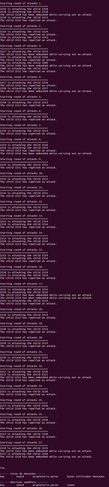

# Process combat

## Introducción
Se realiza un combate entre varios procesos hijos que es abitrado por el proceso padre. Cada proceso hijo decidide aleatoriamente si ataca o defiende. Los procesos atacantes entran en estado indefenso antes de iniciar su ataque y pueden ser emboscados estableciendo su estado como "KO". En el caso de la defensa, el proceso podrá repeler el ataque y su estado se establece a "OK". Los procesos atacantes eligen aleatoriamete un PID válido de la lista de procesos (distinto de cero y distinto de su propio PID) para realizar el ataque. Al acabar la ronda, el proceso hijo envía al proceso padre un mensaje con el resultado de la ronda, esto es con su estado. El proceso padre lee el resultado de la ronda, termina los procesos con estado "KO", actualiza los procesos supervivientes e inicia una nueva ronda siempre que queden dos o más contendientes, en caso contrario, terminan las rondas. Finalmente el resultado puede acabar en empate, si se han eliminado todos los procesos hijos mutuamente, o en victoria de un proceso hijo. Se imprime el resultado final. Al finalizar, el proceso padre demuestra que los recursos IPC se han liberado.

Además, se crea un script en bash llamado *run_processCombat.sh* que hace lo siguiente:

* Compila usando *gcc* las fuentes *father.c* y *child.c*, creando los ejecutables *FATHER* y *CHILD*.
* Crea un FIFO con el resultado llamado *result*.
* Lanza un proceso *cat* en segundo plano a la espera de leer el resultado del fichero FIFO *result*.
* Ejecuta a *FATHER* pasándole como argumento 10, esto consiste en crear 10 procesos hijos, los contendientes.
* Al terminar la ejecución del comando cat, borra todos los archivos ejecutables creados y el fichero FIFO *result*, dejando solo los ficheros fuente *father.c* y *child.c*.

## Instrucciones
Para ejecutar *process combat*, hay que copiar los archivos *father.c*, *child.c* y *run_processCombat.sh* a una carpeta, a elección del usuario. Entonces, desde la terminal del sistema operativo se ejecuta el comando `./run_processCombat.sh`.

## Imagen de demostración
En la siguiente imagen se muestra una ejecución de *process combat*.

## Licencia
Este proyecto está licenciado bajo la Licencia Pública General GNU v3 (GPLv3).

© 2025 Roberto Castillejo Embid. 
Consulte el archivo [LICENSE](./LICENSE) para más detalle.
